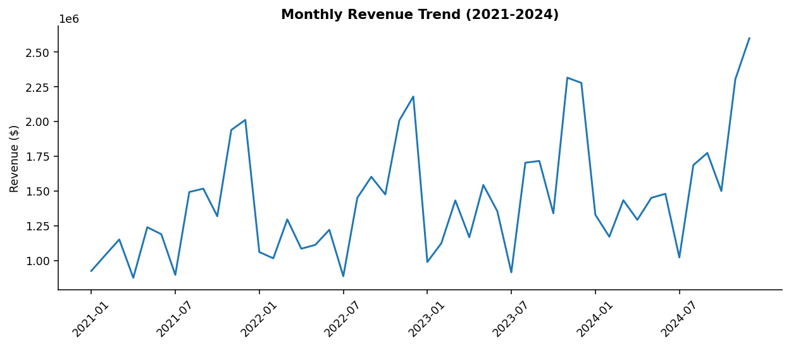
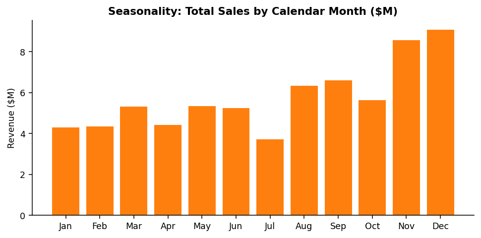
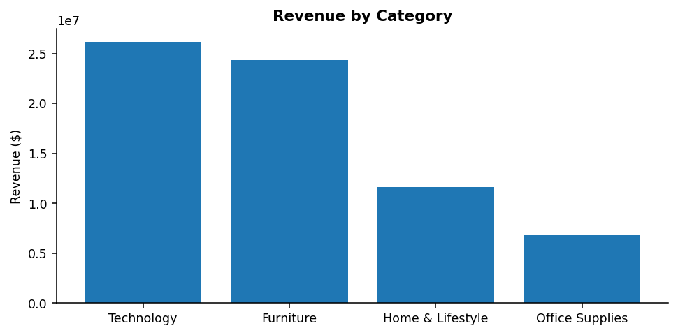
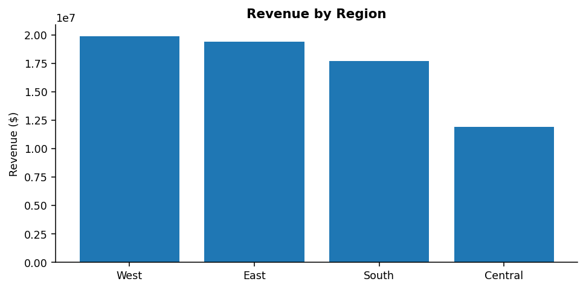
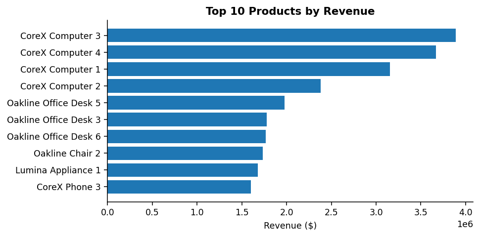
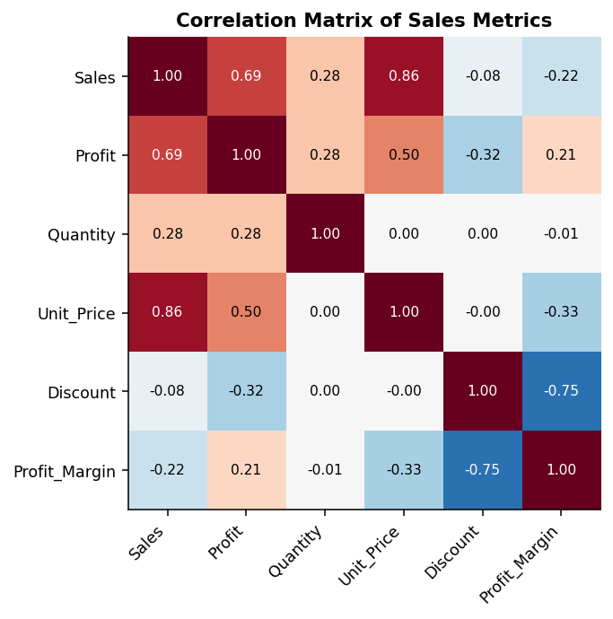
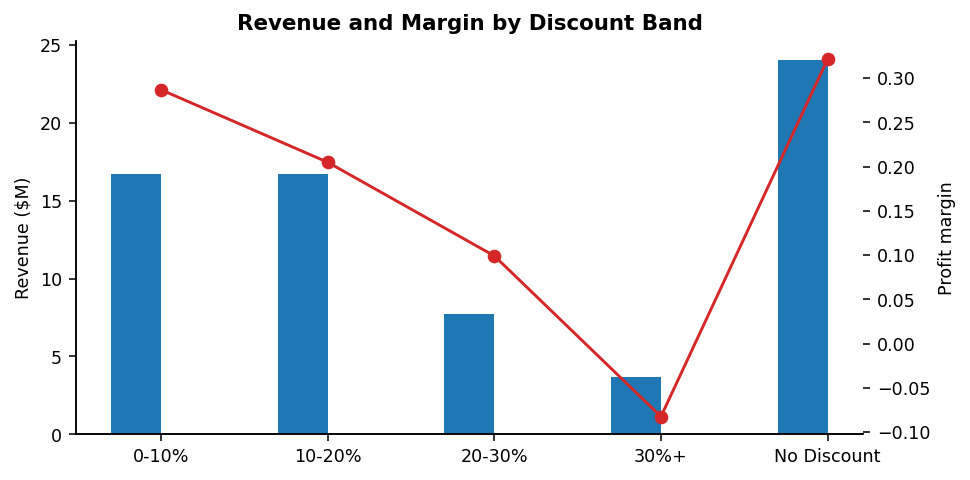
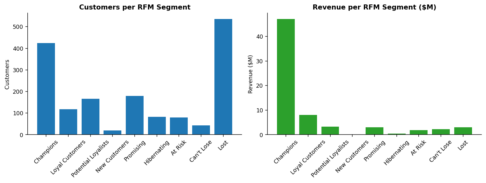

# Retail Sales & Customer Analytics

An end-to-end data analytics project for a multi-region retail company —
from raw transaction data to **actionable, evidence-backed business
recommendations**. Built with **Python, SQL, Statistics and Power BI**.

> Every number quoted below is **computed from the dataset** in this
> repository. Nothing is invented.

---

## Project Overview

A retail company wanted to know *which products, customers, discounts and
regions to invest in* — and which to stop funding. This project answers that
by applying the full data-analyst workflow:

```
Raw CSV ─► Python cleaning ─► EDA & Statistics ─► RFM segmentation
                 │                    │
                 └──► SQLite database ─┘──► Power BI dashboard
                                │
                      Management report + recommendations
```

**Dataset:** 4 years (2021–2024), **117,049 raw records** cleaned to
**108,045 validated order lines**, **33,209 orders**, **1,648 customers**,
**101 products**, across 4 regions, 25 cities, 5 payment methods.

**Headline KPIs:** Revenue **$68.9M** | Profit **$16.4M** | Margin **23.8%** |
AOV **$2,074.90** | CAGR **6.9%**.

---

## Business Problem

1. How are sales performing over time?
2. Which products/categories generate the most revenue — and profit?
3. Which customers are most valuable?
4. Which customer segments are most profitable?
5. What actually influences sales?
6. Which locations perform best?
7. How does buying behaviour change over time?
8. Which products need more attention?
9. **Do discounts actually help?**
10. What should management do next?

## Objectives

- Clean and validate messy transaction data.
- Build a normalised SQL database and answer 12 business questions.
- Prove the discount question with hypothesis testing, not opinion.
- Segment customers with RFM into actionable groups.
- Deliver a 4-page Power BI dashboard for management.
- Write a report where every recommendation cites evidence.

---

## Technology Stack

| Tool | Use |
|------|-----|
| **Python** (Pandas, NumPy) | Cleaning, EDA, feature engineering |
| **SciPy / StatsModels** | Welch t-tests, one-way ANOVA, Pearson correlations |
| **Matplotlib / Seaborn** | Charts in `visuals/` |
| **SQL (SQLite)** | Normalised schema + 21 business/advanced queries |
| **Power BI** | 4-page interactive dashboard (DAX, slicers, drill-down) |
| **Jupyter** | 4 documented notebooks |
| **Excel** | (optional) raw-data spot check |

`requirements.txt` pins everything; the data generator uses a fixed seed so the
whole pipeline is reproducible.

---

## Dataset

Synthetic but **realistic** retail data, generated with seeded randomness
(`python/generate_data.py`). It contains the intentional messiness of real
data so the cleaning phase is meaningful:

- Missing Age (1.6%), City (0.9%) and Discount (1.2%)
- Exact duplicates (0.3%)
- Impossible dates (0.2%) and price typos (10×, negatives)
- Inconsistent category casing
- Cancelled / Returned / Pending orders

**Fields:** Order_ID, Order_Date, Customer_ID, Product_ID, Product_Name,
Category, Sub_Category, Quantity, Unit_Price, Discount, Sales, Cost, Profit,
Profit_Margin, Customer_Name, Customer_Segment, Age, Gender, City, State,
Region, Payment_Method, Order_Status.

---

## Data Cleaning Process (Phase 1–2)

| Issue | Action |
|---|---|
| Invalid dates | Parsed with `errors='coerce'`, impossible rows dropped |
| Negative quantity | Dropped (invalid lines) |
| Price typos | Recalculated via `Sales = Qty × Price × (1 − Discount)` |
| Missing discount | Derived from the same identity, clamped [0, 0.9] |
| Duplicates | Removed |
| Category casing | Standardised to Title Case |
| Missing Age / City | Imputed with segment median / state mode |
| Non-Completed orders | Excluded from revenue analytics (business rule) |
| Unreconcilable lines | Dropped after a final QA reconciliation check |

**Feature engineering:** Order_Year, Order_Month, Order_Day, Day_Of_Week,
Age_Group, Discount_Band, Revenue.

Detailed steps and rationale: `notebooks/01_data_cleaning.ipynb`,
`reports/data_cleaning_report.md`.

---

## Exploratory Data Analysis (Phase 3)

`notebooks/02_eda.ipynb` covers sales, products, customers, geography and
discounts.







**Key EDA findings**

- Revenue grew **+22.1%** (2021→2024) but growth is slowing (YoY 5.1% → 9.1% → 6.5%).
- **December is the peak month — 2.4× July.** Aug–Sep is a secondary peak.
- **Technology = 38% of revenue but only 12.4% margin**; Home & Lifestyle is the
  most profitable category (35.5%).
- **Top 25% of customers = 74% of revenue.**
- New-customer acquisition collapsed: **1,312 (2021) → 66 (2024).**
- Margin by discount band: no discount **32.1%** → 30%+ discount **−8.2%**.

---

## Statistical Analysis (Phase 4)

`notebooks/03_statistical_analysis.ipynb` — every test states H0, H1, the
statistic, p-value, decision and business meaning.

| Test | Result | Decision |
|---|---|---|
| Discounted vs non-discounted margin (Welch t-test) | t = −186.2, p < 0.001 (38.4% → 25.3%) | **Reject H0** — discounts erode margin |
| High- vs low-value customer AOV (Welch t-test) | t = 24.6, p < 0.001 ($2,352 vs $1,087) | **Reject H0** — tiers are structurally different |
| Margin by category (one-way ANOVA) | F = 9,119, p < 0.001 | **Reject H0** — category mix matters |
| Spend by segment (one-way ANOVA) | F = 137.4, p < 0.001 | **Reject H0** — segment drives value |
| Discount vs quantity (Pearson) | r = 0.004, p = 0.19 | **Not significant** — discounts don't lift volume |
| Discount vs profit (Pearson) | r = −0.324, p < 0.001 | Significant negative relationship |
| Age vs spend (Pearson) | r = 0.001, p = 0.95 | Not significant — age isn't a value driver |




---

## RFM Customer Segmentation (Phase 5)

`notebooks/04_rfm_analysis.ipynb`, `python/rfm_analysis.py`.

Recency / Frequency / Monetary scored 1–5 by quintile (recency inverted) →
business segments.

| Segment | Customers | Revenue | Share | Avg recency |
|---|---|---|---|---|
| Champions | 424 | $47.1M | 68.4% | ~1 week |
| Loyal Customers | 118 | $8.0M | 11.6% | ~6 weeks |
| Potential Loyalists | 166 | $3.3M | 4.8% | ~2 weeks |
| Promising | 180 | $3.0M | 4.3% | ~5 weeks |
| At Risk | 80 | $1.8M | 2.7% | ~26 weeks |
| Can't Lose | 43 | $2.2M | 3.3% | ~18 weeks |
| Lost | 536 | $3.0M | 4.3% | ~64 weeks |
| Other | 203 | $0.9M | 1.4% | — |



**Insight:** Champions + Loyal = **33% of customers = 80% of revenue**;
123 at-risk/Can't-Lose customers represent **$4.0M** of recoverable revenue.

---

## SQL Analysis (Phase 6)

Normalised schema (`sql/schema.sql`): `customers`, `products`, `locations`,
`orders`, `order_items`, `payments` — populated into `data/retail.db`.

- `sql/analysis_queries.sql` — the 12 business questions (total revenue, top-10
  products, category profit, top customers, monthly revenue, MoM growth,
  >5 purchases, AOV, regional margin, high-sales/low-profit products,
  inactive customers, top-10-customer revenue share).
- `sql/advanced_queries.sql` — window functions: category product rankings,
  running revenue totals, top-2 customers per region, purchase-gap analysis
  (`LAG`), RFM-in-SQL, discount-band margins, weekday patterns, Pareto check.

**Sample answers**

- Total revenue **$68,905,247**, profit **$16,396,834**, margin **23.8%**.
- Top 10 customers = **7.55%** of revenue.
- Top 20% of products = **54.6%** of revenue (Pareto).
- 30%+ discount band = **−8.2% margin** (net loss **$304,653**).

Full results: `reports/sql_analysis_results.md`, `reports/sql_results/`.

---

## Power BI Dashboard (Phase 7)

A step-by-step guide with all DAX measures is in
`reports/powerbi_build_guide.md` and `powerbi/dax_measures.md` (input data is
already prepared in `data/cleaned/`).

| Page | Contents |
|---|---|
| **1 — Executive Overview** | 6 KPI cards, revenue & profit trends, sales by category/region, top-10 products, 5 sync slicers |
| **2 — Sales Analytics** | Revenue/profit/quantity trends, category & sub-category performance, product ranking, Region→State→City drill-down |
| **3 — Customer Analytics** | Customers, new vs returning, RFM segments, revenue by segment, purchase frequency |
| **4 — Product & Profitability** | Top products by sales/profit, low-margin products, sales-vs-profit and discount-vs-margin scatters |

---

## Key Findings

1. Revenue grew **+22.1%** (CAGR 6.9%) but **new customers fell from 1,312 to 66** — growth now depends on retention.
2. Revenue is **concentrated**: top 25% of customers = 74%; Champions + Loyal = 80%.
3. **Deep discounts destroy profit without lifting volume** (30%+ band = −8.2% margin, −$305K; r(discount, quantity) = 0.004).
4. **Technology drives revenue at 12.4% margin** — 5 of the top-10 products sit below 9%.
5. **December = 2.4× July** — peak-season planning is essential.
6. **Central region** is under-penetrated (17% of revenue) yet highest-margin (24.0%).

## Business Recommendations

| # | Action | Target |
|---|---|---|
| 1 | Cap discounts at 15%; ban blanket 30%+ offers | Protect margin |
| 2 | Champion retention programme | Champions + Loyal (542 customers) |
| 3 | Win-back campaign | At-Risk + Can't-Lose (123 customers, $4.0M) |
| 4 | B2B volume programme | Corporate & Small Business (highest AOV) |
| 5 | Cross-sell Home & Lifestyle with Technology | Improve margin mix |
| 6 | Expand Central region | IL, OH, MI, TX |
| 7 | Seasonal campaign calendar | Nov–Dec & Aug–Sep peaks |
| 8 | Activate one-time buyers (9%) and Lost (536) | Convert to loyalty |

---

## Project Structure

```
retail-sales-customer-analytics/
├── data/
│   ├── raw/                  # raw_retail_sales.csv (117K rows, realistic issues)
│   ├── cleaned/              # retail_sales_clean.csv, customer_rfm.csv
│   └── retail.db             # SQLite database (built by build_database.py)
├── notebooks/
│   ├── 01_data_cleaning.ipynb
│   ├── 02_eda.ipynb
│   ├── 03_statistical_analysis.ipynb
│   └── 04_rfm_analysis.ipynb
├── python/
│   ├── generate_data.py      # reproducible realistic data generator
│   ├── data_cleaning.py      # Phase 1-2 pipeline + cleaning report
│   ├── analysis.py           # Phase 3-4 EDA + statistics -> results JSON
│   ├── rfm_analysis.py       # Phase 5 RFM -> segments + export
│   ├── build_database.py     # Phase 6 -> SQLite from cleaned data
│   ├── run_sql_queries.py    # executes queries -> reports/sql_results
│   ├── build_notebooks.py    # regenerates the 4 notebooks
│   └── build_website.py      # generates the Vercel index.html dashboard
├── sql/
│   ├── schema.sql            # DDL (6 tables, FKs, indexes)
│   ├── analysis_queries.sql  # 13 business queries
│   └── advanced_queries.sql  # window functions, CTEs, Pareto
├── powerbi/
│   └── dax_measures.md       # DAX reference + build guide link
├── reports/
│   ├── business_report.md    # management report (11 sections)
│   ├── data_cleaning_report.md
│   ├── analysis_results.json
│   ├── rfm_results.json / rfm_segments.csv
│   ├── sql_analysis_results.md + sql_results/
│   ├── powerbi_build_guide.md
│   ├── resume_pack.md        # resume bullets, LinkedIn, STAR interview
│   └── interview_prep.md     # 50+ Q&A + 2-minute pitch
├── visuals/                  # charts rendered in this README
├── index.html                # Vercel dashboard (generated)
├── vercel.json               # Vercel static-site configuration
├── requirements.txt
├── README.md
└── .gitignore
```

## How to Run

```bash
# 1. Install dependencies
pip install -r requirements.txt

# 2. (Re)generate raw data (fixed seed -> reproducible)
python python/generate_data.py

# 3. Clean -> data/cleaned + cleaning report
python python/data_cleaning.py

# 4. EDA + statistics -> reports/analysis_results.json + visuals/
python python/analysis.py

# 5. RFM segmentation
python python/rfm_analysis.py

# 6. Build the SQLite database and run all queries
python python/build_database.py
python python/run_sql_queries.py

# 7. (Re)build and execute the notebooks
python python/build_notebooks.py
python -m nbconvert --to notebook --execute --inplace notebooks/*.ipynb
```

Then follow `reports/powerbi_build_guide.md` (≈30 min) to assemble the
Power BI dashboard from `data/cleaned/`.

## Live Demo (Vercel)

This repository is **Vercel-ready**. `index.html` is a self-contained
interactive report (all charts embedded, no build step), and `vercel.json`
ships it with sensible security headers.

```bash
# Option A — Vercel CLI (fastest)
npm i -g vercel
vercel --prod

# Option B — Git integration (recommended for this repo)
#   Dashboard → Import → "Retail-Sales-Customer-Analytics" → Deploy.
#   Vercel detects a static project automatically (no framework configured).
```

Preview locally with any static server:

```bash
python -m http.server 8000    # then open http://localhost:8000
```

To rebuild the site after re-running the analysis:

```bash
python python/build_website.py   # regenerates index.html from visuals/ + reports/
```

## Future Improvements

- Live refresh so RFM and the dashboard update monthly.
- Add marketing cost + channel data for true ROI and CLV modelling.
- Predictive CLV (survival / machine learning on the RFM features).
- Demand forecasting to drive inventory purchases for peak months.
- Experiment design to replace blanket discounts with data-driven pricing.

---

*Created as a portfolio project for Data Analyst / Business Analyst roles. All
metrics are computed from the dataset — see `reports/` for the audit trail.*